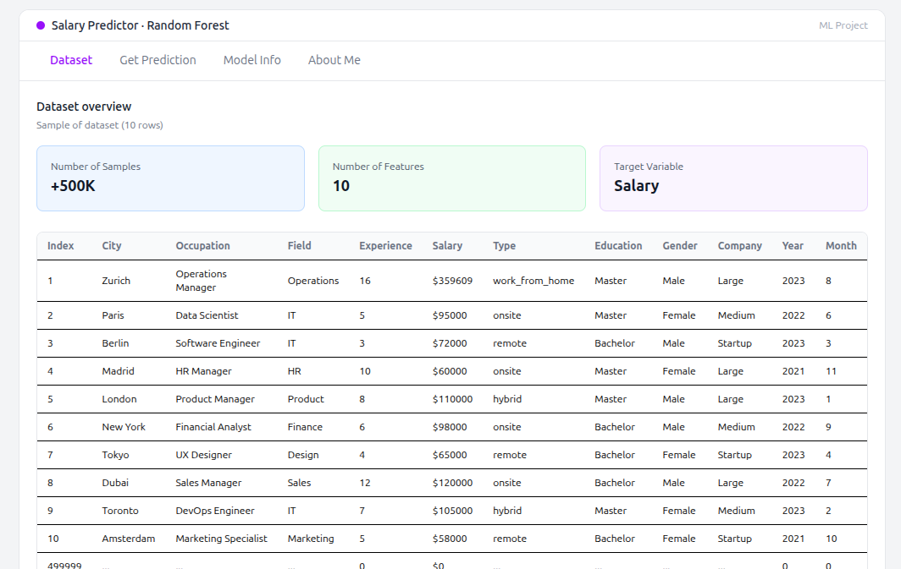
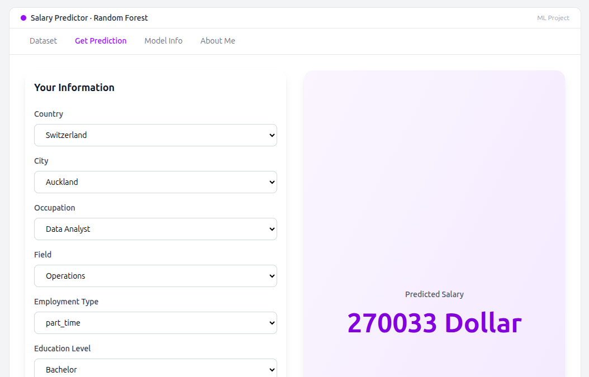
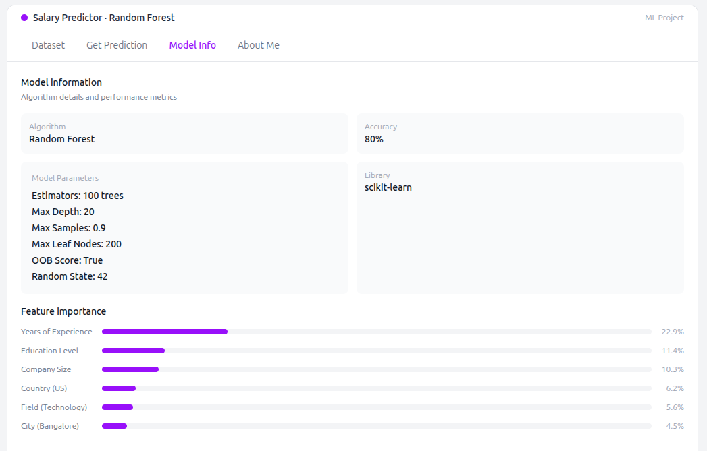

# Salary Prediction Model

## What I built:

A machine learning model based on Random Forest, trained on 500K+ records to predict salary based on features such as years of experience and education level...

Exploratory Data Analysis (EDA) was conducted to understand feature distributions and relationships. See `eda.ipynb` for the full analysis.

The model is deployed via Hugging Face, with a React dashboard deployed on Vercel and a REST API built with FastAPI.

---

## Dataset

> Note: This dataset is synthetically generated and intended for learning purposes only. (it not real)

| Feature    | Description                        |
|------------|------------------------------------|
| City       | Location of the job                |
| Occupation | Job title                          |
| Field      | Industry or domain                 |
| Experience | Years of experience                |
| Salary     | Target variable                    |
| Type       | Employment type                    |
| Education  | Education level                    |
| Gender     | Gender                             |
| Company    | Company name                       |
| Year       | Year of record                     |
| Month      | Month of record                    |

---

## Okay, Fine How I can get started:

Clone the repository:

```bash
git clone https://github.com/KaraniAbdellah/Job_Market
```

### Project Structure

| Folder / File               | Description                        |
|-----------------------------|------------------------------------|
| `frontend/`                 | React user interface               |
| `backend/`                  | FastAPI REST API                   |
| `model_random_forest.ipynb` | Model training notebook            |
| `eda.ipynb`                 | Exploratory Data Analysis notebook |

---

## User Interface

**Dataset Representation**


**Get Prediction**


**Model Information**


## Contributions
I would love to hear your feedback on this project, since it is my first end-to-end project from data to deployment.

